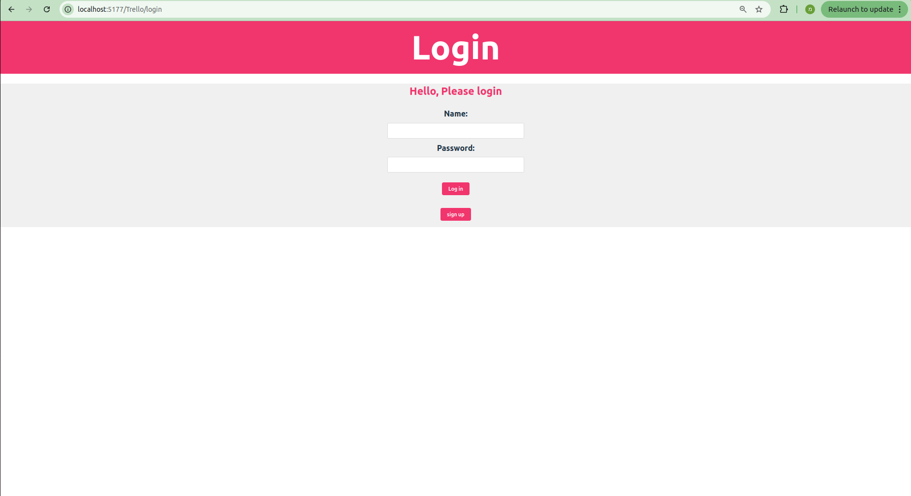
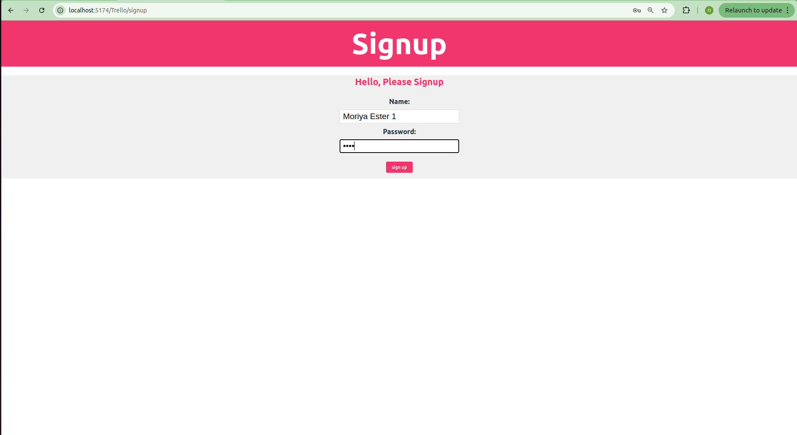
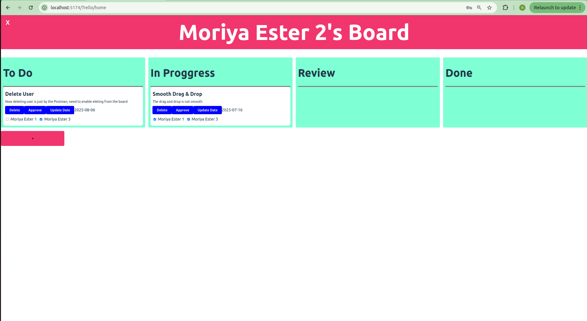

# 📋 Tasks Manager

A web-based task management app inspired by Trello, allowing multiple users to create boards, manage tasks by status, assign collaborators, and update due dates. Designed with a clean UI, intuitive drag-and-drop features, and a simple user authentication system.

---

## 🧠 Features

* 🔐 *Authentication*

  * Signup and login with username and password.
  * Per-user task board access.

* 📂 *Task Board*

  * Kanban-style layout with 4 columns: To Do, In Progress, Review, and Done.
  * Personalized board per user.

* ✏️ *Task Management*

  * Add new tasks with a title, body, status, due date, and collaborators.
  * Assign tasks to one or more users.
  * Update task status and due date.
  * Delete or approve tasks directly from the board.

* 📅 *Calendar Integration*

  * Integrated date picker for setting and updating due dates.

* 👯 *Collaboration*

  * See and manage who is assigned to each task.
  * Collaborative access across boards.

---

## 📸 Screenshots

```



---

## 🚀 Getting Started

### Prerequisites

* Node.js (v18+)
* A modern browser (e.g., Chrome, Firefox)
* Docker (for backend container setup)

### Installation

```bash
# Clone the repository
git clone https://github.com/MoriyaEster/Tasks-Manager.git
cd Tasks-Manager
```

### Run the backend in Docker

```bash
cd Trello/backend
sudo docker-compose up --build
```

### Start the Node.js server

```bash
cd Trello/backend
npm run dev
```

### Run the frontend

```bash
cd Trello
npm run dev
```

Then open your browser at:

```
http://localhost:5174/trello/login
```
---

## 🛠 Tech Stack

* *Frontend*: React, Vite, Styled-Components
* *Drag & Drop*: dnd-kit
* *Backend*: Node.js, Express, MSSQL, Knex.js
* *Authentication*: Custom with session/token logic
* *Deployment*: GitHub Pages (frontend)

---

## 📌 Roadmap

* [ ] Enable user deletion directly from the board
* [ ] Add profile editing features
* [ ] Improve drag-and-drop behavior
* [ ] Add backend integration with database
* [ ] Enable real-time board updates across users

---

## 🤝 Contributing

Contributions are welcome!
Feel free to fork the repo, submit issues, and open pull requests.

---

## 👩‍💼 Author

**Moriya Ester**
[GitHub Profile](https://github.com/MoriyaEster)

---

